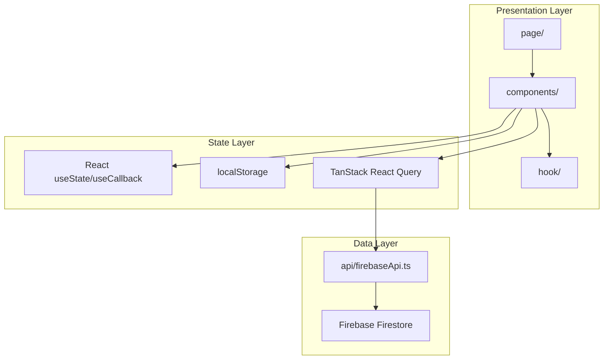
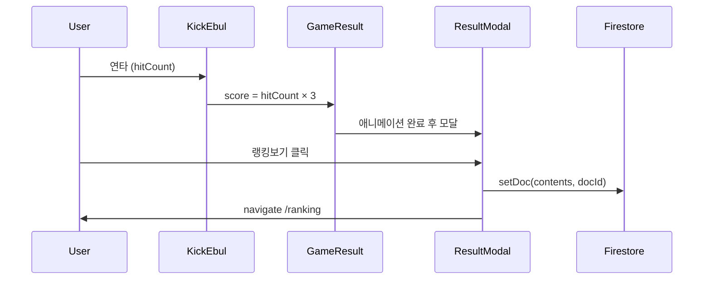

# ARCHITECTURE — 기술 아키텍처

## 1. 기술 스택

| 영역       | 기술                                         | 버전 (package.json 기준)    |
| ---------- | -------------------------------------------- | --------------------------- |
| 런타임     | React                                        | 18.3.1                      |
| 언어       | TypeScript                                   | 5.5.3 (strict)              |
| 빌드       | Vite                                         | 7.3.2 (`package-lock.json`) |
| 스타일     | Tailwind CSS                                 | 3.4.14                      |
| 라우팅     | React Router DOM                             | 6.27.0                      |
| 서버 상태  | TanStack React Query                         | 5.74.3                      |
| 폼         | React Hook Form                              | 7.54.2                      |
| 백엔드     | Firebase (Firestore, Analytics)              | 11.3.1                      |
| 애니메이션 | Lottie React, CSS keyframes, canvas-confetti | —                           |
| 에러 처리  | react-error-boundary                         | 5.0.0                       |
| 유틸       | tailwind-merge                               | 2.5.4                       |

> **버전 기준:** 재현 가능한 설치 버전은 `package-lock.json`을 기준으로 합니다. `package.json`의 Vite 범위는 `^7.2.7`, lockfile은 7.3.2입니다. 검토 당시 로컬 `node_modules`는 5.4.9로 불일치했으므로 `npm ci`로 동기화해야 합니다.

---

## 2. 폴더 구조

```
ebul_kcik/
├── public/
│   └── favicon.svg
├── src/
│   ├── main.tsx                 # React 엔트리
│   ├── App.tsx                  # QueryClient, ErrorBoundary, 앱 셸
│   ├── shared/
│   │   └── Router.tsx           # 라우트 정의
│   ├── page/                    # 페이지 컴포넌트
│   │   ├── Splash.tsx
│   │   ├── Tutorials.tsx
│   │   ├── Game.tsx
│   │   ├── Rank.tsx
│   │   ├── Content.tsx
│   │   ├── SpecialThanks.tsx
│   │   ├── NotFound.tsx
│   │   ├── ErrorFallBack.tsx
│   │   └── Score.tsx            # (미사용 dead code)
│   ├── components/
│   │   ├── game/                # 게임 핵심 UI
│   │   │   ├── KickEbul.tsx
│   │   │   ├── GameResult.tsx
│   │   │   ├── WorryDump.tsx
│   │   │   ├── CountCombo.tsx
│   │   │   └── Modal/
│   │   ├── tutorial/            # 튜토리얼 시퀀스
│   │   ├── rank/                # 랭킹/모아보기 UI
│   │   ├── error/
│   │   └── Loading.tsx
│   ├── api/
│   │   └── firebaseApi.ts       # React Query + Firestore 훅
│   ├── firebase/
│   │   └── firebaseClient.ts    # Firebase 초기화
│   ├── hook/
│   │   └── useModal.tsx         # Portal 기반 모달
│   ├── types/
│   │   └── game.ts              # 도메인 타입
│   ├── utils/
│   │   ├── rank.ts              # 점수/스테이지/랭크 이미지
│   │   ├── worry.ts             # 고민 카테고리/이미지
│   │   └── scripts.ts
│   ├── assets/                  # 이미지, Lottie JSON, SVG
│   └── styles/
│       ├── index.css            # 글로벌, 버튼, 폰트
│       ├── animated.css         # keyframe 애니메이션
│       └── modal.css
├── docs/                        # 프로젝트 문서
├── vercel.json                  # SPA rewrite
├── vite.config.ts
├── tailwind.config.js
└── package.json
```

---

## 3. 앱 아키텍처

### 3.1 레이어 구조



### 3.2 앱 셸 (`App.tsx`)

```
min-h-[100dvh] bg-gray-100
  └── mx-auto max-w-md (모바일 프레임)
        └── max-h-[900px] overflow-y-auto bg-black
              └── QueryClientProvider
                    └── ErrorBoundary
                          └── Router
```

- QueryClient 기본 옵션: `staleTime: 10분`, `refetchOnWindowFocus: false`, `retry: 1`
- 우클릭(`contextmenu`) 전역 차단

### 3.3 게임 Step 오케스트레이션

`Game.tsx`는 step index(0~2)로 컴포넌트를 전환합니다.

| Step | 컴포넌트   | 역할                        |
| ---- | ---------- | --------------------------- |
| 0    | WorryDump  | 고민 작성 모달              |
| 1    | KickEbul   | 연타 게임                   |
| 2    | GameResult | 이불 날아가기 + ResultModal |

`gameState`는 Game.tsx에서 관리하고 하위 컴포넌트에 prop으로 전달합니다.

---

## 4. 상태 관리

### 4.1 localStorage (세션/유저)

| 키         | 읽기                    | 쓰기                |
| ---------- | ----------------------- | ------------------- |
| `nickname` | Game, Door, Rank, Room  | Door, RoomNameModal |
| `uniqueId` | Game, Door, firebaseApi | Door                |
| `isPlay`   | Room, Rank              | ResultModal         |

키 접근은 세션 helper(`src/utils/session.ts`)로 상당 부분 통합되었습니다.

### 4.2 React Query 쿼리 키

| queryKey                   | 훅                  | 용도                 |
| -------------------------- | ------------------- | -------------------- |
| `TOP_RANKS`                | `useGetTopRanks`    | TOP 100 랭킹         |
| `['MY_RANK_INFO', myId]`   | `useMyRankInfo`     | 내 순위              |
| `['GAME_CONTENT', sortBy]` | `useGetGameContent` | 모아보기 정렬별 목록 |

### 4.3 Mutation

| 훅                  | Firestore 작업                           |
| ------------------- | ---------------------------------------- |
| `useSaveScore`      | `setDoc` → `contents/{docId}`            |
| `useReactToContent` | `updateDoc` + `setDoc` → `userReactions` |

---

## 5. Firebase

### 5.1 초기화 (`firebaseClient.ts`)

환경 변수:

- `VITE_API_KEY`
- `VITE_AUTH_DOMAIN`
- `VITE_PROJECT_ID`
- `VITE_STORAGE_BUCKET`
- `VITE_MESSAGING_SENDER_ID`
- `VITE_APP_ID`
- `VITE_MEASUREMENT_ID`

`getFirestore()`, `getAnalytics()` 초기화. `analytics`는 export되나 **커스텀 이벤트 추적에는 미사용**입니다.

저장소에는 `firebase.json`, Firestore Security Rules, 인덱스 설정이 없습니다. 따라서 실제 배포 프로젝트의 읽기/쓰기 권한은 이 코드만으로 검증할 수 없습니다. 운영 전 [SECURITY-PRIVACY.md](./SECURITY-PRIVACY.md)의 점검이 필요합니다.

### 5.2 Firestore 컬렉션

#### `contents`

게임 결과 및 UGC 고민 저장.

```typescript
// src/types/game.ts
type TGameContent = {
  id: string
  user: string
  userId: string
  score: number
  worryLabel: TworryLabel
  content: string
  createdAt: string // 실제: Firestore Timestamp
  reactions: Record<TworryReaction, number>
  reactionTotal: number
}
```

#### `userReactions`

공감 중복 방지. 문서 ID: `{userId}_{contentId}`.

### 5.3 데이터 흐름



### 5.4 Firestore 쿼리

| 쿼리     | orderBy                                      | limit |
| -------- | -------------------------------------------- | ----- |
| TOP 랭킹 | `score desc`                                 | 100   |
| 모아보기 | `createdAt` / `score` / `reactionTotal desc` | 100   |
| 내 순위  | `where('score', '>', myScore)` + count       | —     |

---

## 6. 에셋 로딩 패턴

### 6.1 현재 방식

1. **Vite static import** — `import img from '../assets/...'`로 빌드된 URL을 얻음
2. **렌더링** — `` 또는 `background-image`가 실제로 적용될 때 브라우저가 이미지 요청/디코딩
3. **Lottie** — JSON import → `lottie-react` 컴포넌트
4. **Route lazy** — Rank, Content, SpecialThanks만 `React.lazy`

### 6.2 에셋 디렉터리

| 경로                  | 내용                             |
| --------------------- | -------------------------------- |
| `assets/game/`        | 게임 배경, kick SVG, rank 아이콘 |
| `assets/game/write/`  | 고민 카테고리 아이콘 9 + 패턴 9  |
| `assets/game/result/` | stage1~5.webp, blanket.png       |
| `assets/tutorial/`    | door, room, bed 시퀀스           |
| `assets/rank/`        | 1~3등, 공감 아이콘               |
| `assets/lottie/`      | splash.json, loading.json        |

### 6.3 미적용 최적화

- `<link rel="preload">` 없음
- `` 없음
- `new Image()` / `decode()` preload 없음
- 이미지 빌드 최적화 플러그인 없음
- Game step별 code splitting 없음

> static import가 이미지 파일 자체를 JS 번들에 인라인하거나 모든 이미지를 즉시 다운로드한다는 뜻은 아닙니다. 현재 병목은 실제 빌드 크기와 Network/Performance 측정으로 판단해야 합니다.

남은 성능 항목: [ROADMAP.md](./ROADMAP.md) 「잔여 코드 품질 항목」

---

## 7. 애니메이션 시스템

| 유형              | 사용처                               | 파일                        |
| ----------------- | ------------------------------------ | --------------------------- |
| CSS keyframes     | hit effect, 이불 fly/stop, 모달 fade | `src/styles/animated.css`   |
| Lottie            | Splash, Loading                      | `Splash.tsx`, `Loading.tsx` |
| canvas-confetti   | SpecialThanks 이스터에그             | `SpecialThanks.tsx`         |
| Tailwind built-in | countdown bounce, timer pulse        | `KickEbul.tsx`              |

이불 애니메이션은 `--stage-height` CSS 변수(`window.innerHeight`)와 `onAnimationEnd` 체인으로 stage를 순차 재생합니다.

---

## 8. 타입 시스템

도메인 타입은 `src/types/game.ts`에 집중:

- `TGameState`, `TGameContent`, `TEffect`
- `TworryLabel`, `TworryReaction`, `TSortType`
- `TWorryContent`

프로젝트 컨벤션: type alias에 `T` prefix 사용.

---

## 9. 배포

- **플랫폼:** Vercel
- **설정:** `vercel.json` — SPA rewrite (`/(.*)` → `/`)
- **빌드:** `tsc -b && vite build`
- **환경 변수:** Firebase VITE\_\* 키 (Vercel 대시보드 설정)

---

## 10. 알려진 아키텍처 이슈

| 이슈                           | 영향                                          | 문서                |
| ------------------------------ | --------------------------------------------- | ------------------- |
| 전역 touch-action/user-select  | Content/Rank 스크롤·선택 접근성 저하          | ROADMAP.md 잔여     |
| createdAt 타입 불일치          | Firestore 읽기값과 타입 정의 어긋남           | ROADMAP.md 잔여     |
| 오디오 레이어 없음             | 게임 몰입감 부족                              | AUDIO.md            |
| 게임 연출·접근성 개선 미착수   | 키보드 입력·연출 완성도                       | GAME-EXPERIENCE.md, UI-UX.md |
