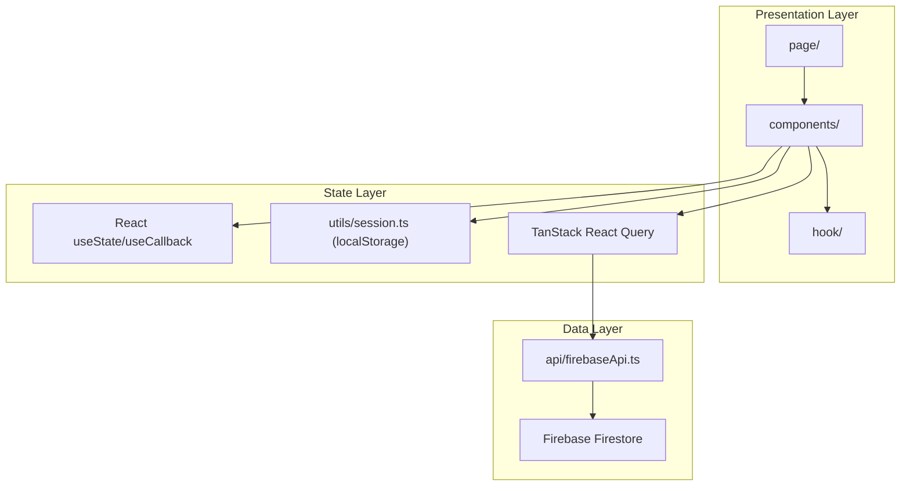
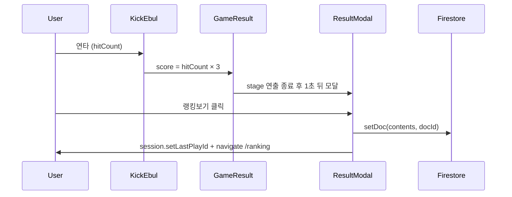

# ARCHITECTURE — 기술 아키텍처

> 최종 코드 대조일: **2026-09-16** (`pnpm run lint / build / test / test:rules` 실행 기준)

## 1. 기술 스택

| 영역       | 기술                                         | package.json 범위 | 설치 버전 (pnpm-lock) |
| ---------- | -------------------------------------------- | ----------------- | --------------------- |
| 런타임     | React                                        | ^18.3.1           | 18.3.1                |
| 언어       | TypeScript (strict)                          | ^5.5.3            | 5.9.3                 |
| 빌드       | Vite                                         | ^7.2.7            | 7.3.2                 |
| 스타일     | Tailwind CSS                                 | ^3.4.14           | 3.4.19                |
| 라우팅     | React Router DOM                             | ^6.27.0           | 6.30.3                |
| 서버 상태  | TanStack React Query                         | ^5.74.3           | 5.90.12               |
| 폼         | React Hook Form                              | ^7.54.2           | 7.68.0                |
| 백엔드     | Firebase (Firestore)                         | ^11.3.1           | 11.10.0               |
| 애니메이션 | Lottie React, CSS keyframes, canvas-confetti | ^2.4.1 / ^1.9.3   | 2.4.1 / 1.9.4         |
| 에러 처리  | react-error-boundary                         | ^5.0.0            | 5.0.0                 |
| 테스트     | Vitest / @firebase/rules-unit-testing        | ^3.2.6 / ^4.0.1   | 3.2.6 / 4.0.1         |
| 유틸       | tailwind-merge                               | ^2.5.4            | 2.6.0                 |

> **패키지 매니저·버전 기준:** 이 프로젝트는 **pnpm**(`packageManager: pnpm@10.12.4`)을 사용합니다. 재현 가능한 설치 버전은 `pnpm-lock.yaml`을 기준으로 하며, `pnpm install --frozen-lockfile`로 lockfile과 설치 상태를 일치시킵니다. `package.json`은 caret 범위이므로 위 두 열은 서로 다를 수 있고, **실제 동작 기준은 오른쪽 열(lockfile)** 입니다.

---

## 2. 폴더 구조

```
ebul_kcik/
├── public/
│   ├── favicon.svg
│   └── og-main-image.webp
├── src/
│   ├── main.tsx                 # React 엔트리
│   ├── App.tsx                  # QueryClient, ErrorBoundary, 앱 셸
│   ├── vite-env.d.ts
│   ├── shared/
│   │   └── Router.tsx           # 라우트 정의 (route lazy + Suspense)
│   ├── page/                    # 페이지 컴포넌트
│   │   ├── Splash.tsx
│   │   ├── Tutorials.tsx
│   │   ├── Game.tsx
│   │   ├── Rank.tsx
│   │   ├── Content.tsx
│   │   ├── SpecialThanks.tsx
│   │   ├── NotFound.tsx
│   │   └── ErrorFallBack.tsx
│   ├── components/
│   │   ├── game/                # 게임 핵심 UI
│   │   │   ├── KickEbul.tsx
│   │   │   ├── GameResult.tsx
│   │   │   ├── WorryDump.tsx
│   │   │   ├── CountCombo.tsx
│   │   │   └── Modal/           # WorryContentModal, RoomNameModal, ResultModal
│   │   ├── tutorial/            # Door, Room, Bed 시퀀스
│   │   ├── rank/                # RankTab, FloatBtn, InfoModal, ContentModal
│   │   ├── error/
│   │   │   └── Error.tsx
│   │   ├── ErrorRetry.tsx       # 쿼리 실패 재시도 UI + EmptyState
│   │   └── Loading.tsx          # CSS 스피너 (export 이름은 LottieLoading 유지)
│   ├── api/
│   │   └── firebaseApi.ts       # React Query + Firestore 훅
│   ├── firebase/
│   │   └── firebaseClient.ts    # Firebase 초기화
│   ├── hook/
│   │   └── useModal.tsx         # Portal 모달 + focus trap/ESC
│   ├── types/
│   │   ├── game.ts              # 도메인 타입
│   │   └── index.d.ts           # 모듈 선언 (canvas-confetti)
│   ├── utils/
│   │   ├── rank.ts              # 점수/tier/스테이지·랭크 이미지
│   │   ├── rank.test.ts
│   │   ├── worry.ts             # 고민 카테고리/이미지/반응 아이콘
│   │   ├── session.ts           # localStorage 세션 helper (유일한 접근 창구)
│   │   ├── toast.ts             # 인앱 토스트 (alert 대체)
│   │   ├── validateContent.ts   # Firestore 문서 파싱·검증(parseGameContent)
│   │   ├── validateContent.test.ts
│   │   └── scripts.ts           # 튜토리얼 대사
│   ├── assets/                  # game/ tutorial/ rank/ lottie/ etc/ icon/
│   └── styles/
│       ├── index.css            # 글로벌, 버튼, 폰트(Galmuri CDN)
│       ├── animated.css         # keyframe + prefers-reduced-motion
│       └── modal.css
├── test/
│   └── firestore.rules.test.mjs # Firestore Rules 테스트 (에뮬레이터, 25 케이스)
├── docs/                        # 프로젝트 문서
├── .github/workflows/ci.yml     # lint·build·test + rules test
├── firebase.json                # Firestore rules/indexes 경로
├── .firebaserc                  # 기본 Firebase 프로젝트 별칭
├── .env.example                 # 필요한 VITE_* 키 목록
├── firestore.rules              # Firestore Security Rules
├── firestore.indexes.json       # Firestore 인덱스 설정 (현재 빈 배열)
├── vercel.json                  # SPA rewrite
├── vite.config.ts               # Vite 설정 (react 플러그인)
├── vitest.config.ts             # Vitest 설정 (src/**/*.test.ts만 포함)
├── tailwind.config.js
├── pnpm-lock.yaml
└── package.json
```

---

## 3. 앱 아키텍처

### 3.1 레이어 구조



### 3.2 앱 셸 (`App.tsx`)

```
min-h-[100dvh] bg-gray-100
  └── mx-auto flex h-[100dvh] max-w-md items-center justify-center bg-white
        └── h-full max-h-[900px] w-full overflow-y-auto bg-black
              └── QueryClientProvider
                    └── ErrorBoundary (ErrorFallBack)
                          └── Router
```

- QueryClient는 모듈 스코프에서 1회 생성 (App 재렌더 시 캐시 유지)
- 기본 옵션: `staleTime: 10분`, `refetchOnWindowFocus: false`, `retry: 1`
- 우클릭(`contextmenu`) 전역 차단

### 3.3 게임 Step 오케스트레이션

`Game.tsx`는 step index(0~2)로 컴포넌트를 전환합니다.

| Step | 컴포넌트   | 역할                        | 로딩 방식 |
| ---- | ---------- | --------------------------- | --------- |
| 0    | WorryDump  | 고민 작성 모달              | static    |
| 1    | KickEbul   | 연타 게임                   | `lazy`    |
| 2    | GameResult | 이불 날아가기 + ResultModal | `lazy`    |

- step 1·2는 고민 작성 이후에만 필요하므로 `React.lazy` + `Suspense`로 분리되어 있습니다(빌드 산출물의 `KickEbul-*.js`, `GameResult-*.js` chunk).
- `gameState`는 Game.tsx에서 관리하고 하위 컴포넌트에 prop으로 전달합니다.
- 진입 가드: `session.getNickname()` / `session.getUniqueId()`가 없으면 `/`로 리다이렉트.

---

## 4. 상태 관리

### 4.1 localStorage (세션/유저)

`src/utils/session.ts`가 유일한 접근 창구입니다. 현재 컴포넌트에서 `localStorage`를 직접 호출하는 코드는 없습니다.

| 키         | session API                                | 용도                              |
| ---------- | ------------------------------------------ | --------------------------------- |
| `nickname` | `getNickname` / `setNickname`               | 닉네임 (한글 5자 이내)            |
| `uniqueId` | `getUniqueId` / `ensureUniqueId`            | UUID, Firestore `userId`          |
| `isPlay`   | `getLastPlayId` / `setLastPlayId`           | 최근 플레이 docId (내 순위 조회)  |
| —          | `hasIdentity`                               | 닉네임+UUID 보유 여부             |

> 세션 값은 인증 수단이 아닙니다. 보안 경계는 Firestore Rules가 담당합니다.

### 4.2 React Query 쿼리 키

| queryKey                   | 훅                  | 용도                 |
| -------------------------- | ------------------- | -------------------- |
| `['TOP_RANKS']`            | `useGetTopRanks`    | TOP 100 랭킹         |
| `['MY_RANK_INFO', myId]`   | `useMyRankInfo`     | 내 순위              |
| `['GAME_CONTENT', sortBy]` | `useGetGameContent` | 모아보기 정렬별 목록 |

목록 조회는 `parseGameContent`로 문서를 검증해 비정상 문서를 걸러낸 뒤 반환합니다.

### 4.3 Mutation

| 훅                  | Firestore 작업                                                                 |
| ------------------- | ------------------------------------------------------------------------------ |
| `useSaveScore`      | `setDoc` → `contents/{docId}`, 성공 시 3개 쿼리 캐시 무효화                     |
| `useReactToContent` | `runTransaction`으로 중복 확인 → `increment(1)` 업데이트 → `userReactions` 기록 |

`useReactToContent`는 동시 요청으로 인한 중복 카운트·부분 성공을 막기 위해 트랜잭션으로 원자 처리하며, 본인 글/중복 공감은 예외를 던져 `toast`로 안내합니다.

---

## 5. Firebase

### 5.1 초기화 (`firebaseClient.ts`)

환경 변수:

- `VITE_API_KEY`
- `VITE_AUTH_DOMAIN`
- `VITE_PROJECT_ID`
- `VITE_STORAGE_BUCKET`
- `VITE_MESSAGING_SENDER_ID`
- `VITE_APP_ID`
- `VITE_MEASUREMENT_ID`

`initializeApp()` 후 `getFirestore()`만 초기화하여 `app`, `db`를 export합니다. **Analytics는 초기화하지 않습니다**(`getAnalytics` 호출 없음). `VITE_MEASUREMENT_ID`는 config 객체에 남아 있으나 실제로 사용되지 않습니다. Firebase Auth도 사용하지 않습니다.

저장소에 `firebase.json`, Firestore Security Rules([firestore.rules](../firestore.rules)), 인덱스 설정(`firestore.indexes.json`)이 있습니다. 다만 규칙 변경은 `firebase deploy --only firestore:rules`로 배포해야 실제 반영되므로, 저장소 규칙과 배포 프로젝트의 실제 권한이 일치하는지는 별도 확인이 필요합니다.

### 5.2 Firestore 컬렉션

#### `contents`

게임 결과 및 UGC 고민 저장.

```typescript
// src/types/game.ts
type TGameContent = {
  id: string
  user: string
  userId: string
  score: number
  worryLabel: TworryLabel
  content: string
  createdAt: Timestamp // Firestore Timestamp (firebase/firestore)
  reactions: Record<TworryReaction, number>
  reactionTotal: number
}
```

#### `userReactions`

공감 중복 방지. 문서 ID: `{userId}_{contentId}`, 필드는 `{ shock?: true, laugh?: true, sad?: true }`.

### 5.3 데이터 흐름



### 5.4 Firestore 쿼리

| 쿼리     | orderBy                                      | limit |
| -------- | -------------------------------------------- | ----- |
| TOP 랭킹 | `score desc`                                 | 100   |
| 모아보기 | `createdAt` / `score` / `reactionTotal desc` | 100   |
| 내 순위  | `where('score', '>', myScore)` + count       | —     |

### 5.5 Security Rules 요약

- `contents`: 누구나 read, create는 필드 화이트리스트·타입·길이 검증(닉네임 한글 1~5자, content ≤ 500자, userId ≤ 64자)·**점수 상한 3000m**·초기 reaction 0 검증, update는 `reactions`/`reactionTotal` +1만 허용, delete 금지
- `userReactions`: read 허용, `shock/laugh/sad = true`만 기록, delete 금지
- 점수 상한 3000m은 게임 20초 × `SCORE_MULTIPLIER`(3) 기준 초당 50회 연타에 해당하는 여유값으로, 정상 플레이로는 도달할 수 없습니다. 게임 시간·배수를 바꾸면 규칙도 함께 조정해야 합니다.
- Auth 미사용이므로 소유권(`request.auth.uid`) 검증은 불가합니다(App Check는 규모상 제외, 판단 근거는 [DEVELOPMENT.md](./DEVELOPMENT.md) §7.3). 상한 이내의 자작 기록 등록, userId 사칭, 공감 수 부풀리기, 요청 빈도 제한은 Rules로 막을 수 없으며 App Check 또는 Anonymous Auth 도입이 선행되어야 합니다.

---

## 6. 에셋 로딩 패턴

### 6.1 현재 방식

1. **Vite static import** — `import img from '../assets/...'`로 빌드된 URL 또는 data URI를 얻음
2. **인라인 임계값** — `vite.config.ts`에서 `build.assetsInlineLimit = 0`으로 지정해 **모든 이미지를 별도 파일로 분리**합니다. 이전에는 Vite 기본값(4096B) 때문에 같은 화면의 이미지 일부만 인라인되어 서로 다른 시점에 나타나는 문제가 있었습니다.
3. **렌더링** — `` 또는 `background-image`가 실제로 적용될 때 브라우저가 이미지 요청/디코딩
4. **Lottie** — splash.json import → `lottie-react` 컴포넌트 (Splash 전용)
5. **Route lazy** — Rank, Content, SpecialThanks (`React.lazy`)
6. **게임 step lazy** — KickEbul, GameResult (`Game.tsx`)

> 인라인 여부가 4KB에서 갈리기 때문에 같은 화면의 이미지가 서로 다른 타이밍에 나타납니다. 증상·실측·개선안은 [ISSUE-IMAGE-LOADING.md](./ISSUE-IMAGE-LOADING.md)를 참고하세요.

### 6.2 에셋 디렉터리

| 경로                  | 내용                             |
| --------------------- | -------------------------------- |
| `assets/game/`        | 게임 배경, kick SVG, rank 아이콘 |
| `assets/game/write/`  | 고민 카테고리 아이콘 9 + 패턴 9 + close |
| `assets/game/result/` | stage1~5.webp, blanket.png       |
| `assets/tutorial/`    | door, room, bed 시퀀스           |
| `assets/rank/`        | 1~3등, 공감 아이콘               |
| `assets/lottie/`      | splash.json(사용), loading.json(현재 미사용) |
| `assets/etc/`, `assets/icon/` | askBanner, hmm, error icon |

### 6.3 적용된 최적화

- `assetsInlineLimit = 0`으로 이미지 인라인/파일 이원화 제거 (`vite.config.ts`) — 같은 화면 이미지가 서로 다른 시점에 나타나는 문제 해소
- 튜토리얼 주요 이미지(`Door`·`Room`·`Bed`·`WorryDump`)에 `width`/`height` 지정으로 로드 전 레이아웃 점프 최소화
- 게임 배경(`game.webp`)을 `new Image()` + `decode()`로 준비한 뒤 "게임 시작" 버튼 활성화 (`KickEbul.tsx:24-36`)
- 결과 이미지(stage 5장 + blanket) 사전 디코딩으로 stage 전환 깜빡임 방지 (`GameResult.tsx:24-32`)
- 튜토리얼 다음 화면 이미지(`Door` → dooropen, `Bed` 다음 대사 이미지) 사전 디코딩
- Loading을 Lottie(loading.json, 약 819KB)에서 CSS 스피너로 교체해 초기 번들에서 제거 (`Loading.tsx`)
- 라우트 lazy(Rank·Content·SpecialThanks) + 게임 step lazy(KickEbul·GameResult)
- Galmuri 폰트 CDN `preconnect` / `dns-prefetch` (`index.html`)

### 6.4 미적용 최적화

- `<link rel="preload">` 없음 — 이미지 URL이 HTML에 없어 프리로드 스캐너가 선행 요청하지 못함
- 목록 이미지 `loading="lazy"` 없음
- 이미지 빌드 최적화 플러그인 없음
- `manualChunks` 등 메인 chunk 분할 설정 없음 (`vite.config.ts`는 react 플러그인만 사용)
- `assets/lottie/splash.json` 내장 PNG(약 353KB)는 경량화 여지 있음
- `assets/lottie/loading.json`(819KB)은 더 이상 참조되지 않는 잔여 파일

> 번들 크기·인라인 비율은 추정이 아니라 `pnpm build` 산출물과 Network/Performance 측정으로 판단해야 합니다. 현재 실측치는 [DEVELOPMENT.md](./DEVELOPMENT.md) §5와 [ISSUE-IMAGE-LOADING.md](./ISSUE-IMAGE-LOADING.md) §3에 기록되어 있습니다.

남은 성능 항목: [ROADMAP.md](./ROADMAP.md) 「성능 잔여 항목」

---

## 7. 애니메이션 시스템

| 유형              | 사용처                               | 파일                        |
| ----------------- | ------------------------------------ | --------------------------- |
| CSS keyframes     | hit effect, 이불 fly/stop, stage fade, 모달 fade/slide | `src/styles/animated.css`, `src/styles/modal.css` |
| Lottie            | Splash                               | `src/page/Splash.tsx`       |
| CSS 스피너        | 로딩 (Lottie 대체)                   | `src/components/Loading.tsx` |
| canvas-confetti   | SpecialThanks 이스터에그             | `src/page/SpecialThanks.tsx` |
| Tailwind built-in | countdown bounce, timer pulse        | `src/components/game/KickEbul.tsx` |

- 이불 애니메이션은 `--stage-height` CSS 변수(`window.innerHeight`, 900px 상한)와 `onAnimationEnd` 체인으로 stage를 순차 재생하며, resize·회전 시 높이를 다시 계산합니다.
- `prefers-reduced-motion: reduce`에서는 pop/burst/fade 계열 애니메이션을 끄고, 이불 연출은 흔들림 없이 짧게 마무리합니다(`animated.css`).

---

## 8. 타입 시스템

도메인 타입은 `src/types/game.ts`에 집중:

- `TGameState`, `TGameContent`, `TEffect`
- `TworryLabel`, `TworryReaction`, `TSortType`
- `TWorryContent`

프로젝트 컨벤션: type alias에 `T` prefix 사용.

---

## 9. 배포와 CI

- **플랫폼:** Vercel
- **설정:** `vercel.json` — SPA rewrite (`/(.*)` → `/`)
- **빌드:** `tsc -b && vite build`
- **환경 변수:** Firebase VITE\_\* 키 (Vercel 대시보드 설정, 키 목록은 `.env.example`)
- **보안 헤더:** `vercel.json` — `X-Content-Type-Options`, `X-Frame-Options: DENY`, `Referrer-Policy`, `Permissions-Policy`, CSP(현재 Report-Only). 전환 절차는 [DEVELOPMENT.md](./DEVELOPMENT.md) §7.3
- **CI:** `.github/workflows/ci.yml` (GITHUB_TOKEN은 `contents: read` 최소 권한) — main/dev의 PR·push에서 `lint → build → test` 및 별도 job으로 `test:rules`(Java 17 + 에뮬레이터) 실행

---

## 10. 알려진 아키텍처 이슈

| 이슈                                   | 영향                                        | 문서                   |
| -------------------------------------- | ------------------------------------------- | ---------------------- |
| 메인 chunk 1,032KB (gzip 481KB)        | 초기 로드 비용 — splash.json·lottie-web 포함 | ROADMAP.md 성능 잔여   |
| 이미지 로딩 타이밍 불균일 (일부 완화, `<link rel="preload">`·splash.json 경량화 등 후속 항목 남음) | 모바일 첫 진입 시 이미지 팝인·레이아웃 점프 | ISSUE-IMAGE-LOADING.md |
| 오디오 레이어 없음                     | 게임 몰입감 부족                            | AUDIO.md               |
| Firebase Auth 미사용                   | Rules에서 소유권 검증 불가                  | ROADMAP.md Phase 4     |
| UGC 신고/삭제 경로 없음                | 운영 시 콘솔 수동 처리                      | ROADMAP.md Phase 4     |

> 과거 이슈였던 전역 `touch-action`/`user-select`, `createdAt` 타입 불일치, 공감 중복 카운트는 해결됨(전역 CSS 제거, 타입 `Timestamp` 통일, `runTransaction` 적용).
> 게임 연출(progress UI·콤보·crossfade·easing·resize)과 접근성(모달 focus trap·키보드 입력·`prefers-reduced-motion`)은 코드 적용 완료입니다.
