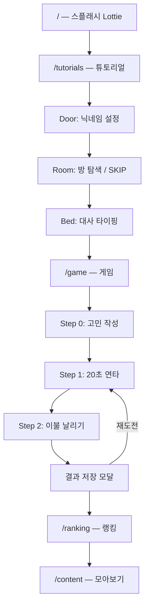

# PRD — 제품 요구사항 정의서

## 1. 제품 개요

### 1.1 컨셉

**이불뚫고 지붕킥**은 밤에 잠 못 이루며 이불을 발로 차던 경험을 게임화한 카타르시스 웹 앱입니다. 사용자는 말실수, 흑역사, 걱정거리 등 고민을 카테고리와 함께 작성한 뒤, 제한 시간 안에 화면을 빠르게 터치해 이불을 멀리 날려보냅니다.

### 1.2 타겟 플랫폼

- **모바일 웹** (모바일 우선)
- 앱 셸: 화면 폭을 채우되 `max-w-md` (448px), 높이는 `100dvh`를 사용하고 900px에서 제한
- 배포: Vercel SPA

### 1.3 핵심 가치

| 가치        | 설명                                      |
| ----------- | ----------------------------------------- |
| 카타르시스  | 고민을 글로 적고 물리적 행위(연타)로 해소 |
| 소셜        | 랭킹 경쟁, 다른 사람 고민 구경, 공감 반응 |
| 가벼운 재미 | 짧은 플레이타임(약 1~2분), 즉시 시작 가능 |

---

## 2. 사용자 플로우



### 2.1 재방문 플로우

- `localStorage.isPlay` 존재 시 Room 단계에서 **SKIP** 버튼 노출
- SKIP → `/game` 또는 `/content` 바로가기

### 2.2 게임 진입 가드

- `nickname`, `uniqueId` 없으면 `/game` 접근 시 `/`로 리다이렉트
- 핵심 파일: `src/page/Game.tsx`

---

## 3. 기능 명세 (현재 구현 기준)

### 3.1 온보딩

| 기능           | 상세                                            | 파일                                          |
| -------------- | ----------------------------------------------- | --------------------------------------------- |
| 스플래시       | Lottie 애니메이션, 완료 시 `/tutorials` 이동    | `src/page/Splash.tsx`                         |
| 닉네임 등록    | 한글만, 최대 5자, `localStorage.nickname` 저장  | `src/components/game/Modal/RoomNameModal.tsx` |
| 유저 ID        | `crypto.randomUUID()` → `localStorage.uniqueId` | `src/components/tutorial/Door.tsx`            |
| 튜토리얼 3단계 | Door → Room → Bed, 타자기 효과 대사             | `src/page/Tutorials.tsx`                      |

### 3.2 게임

| 기능        | 상세                                                          | 파일                                              |
| ----------- | ------------------------------------------------------------- | ------------------------------------------------- |
| 고민 작성   | 9카테고리 선택 + textarea (최대 500자)                        | `src/components/game/Modal/WorryContentModal.tsx` |
| 연타 게임   | 5초 카운트다운 → 20초 연타, `onPointerDown` 입력              | `src/components/game/KickEbul.tsx`                |
| 타격 피드백 | hit SVG 이펙트, CountCombo (10회 burst)                       | `src/components/game/CountCombo.tsx`              |
| 결과 연출   | 점수별 5단계 stage, 이불 fly/stop CSS 애니메이션              | `src/components/game/GameResult.tsx`              |
| 점수 저장   | Firestore `contents` 컬렉션, docId = `{uniqueId}_{timestamp}` | `src/components/game/Modal/ResultModal.tsx`       |
| 재도전      | 고민 유지, step 1(연타)로 복귀                                | `src/page/Game.tsx` `initGame()`                  |

### 3.3 소셜

| 기능     | 상세                                                        | 파일                                     |
| -------- | ----------------------------------------------------------- | ---------------------------------------- |
| 랭킹     | TOP 100 (score desc), TOP 3 시상대 UI                       | `src/page/Rank.tsx`                      |
| 내 순위  | `localStorage.isPlay` docId 기준 플로팅 표시                | `src/api/firebaseApi.ts` `useMyRankInfo` |
| 모아보기 | 2열 그리드, 정렬(최신/거리/공감)                            | `src/page/Content.tsx`                   |
| 공감     | shock / laugh / sad 3종, 본인 글 제외, 반응 종류별 1회 제한 | `src/components/rank/ContentModal.tsx`   |

### 3.4 기타

| 기능           | 상세                              | 파일                                |
| -------------- | --------------------------------- | ----------------------------------- |
| 공유/피드백    | InfoModal — URL 복사, 피드백 링크 | `src/components/rank/InfoModal.tsx` |
| Special Thanks | 제작 후기, confetti 이스터에그    | `src/page/SpecialThanks.tsx`        |
| 404            | NotFound 페이지                   | `src/page/NotFound.tsx`             |

---

## 4. 고민 카테고리

9종 (`src/utils/worry.ts`):

| ID      | 라벨     | 설명 텍스트              |
| ------- | -------- | ------------------------ |
| talk    | 말       | 입이 문제야              |
| young   | 어린시절 | 귀엽지만은 않은 어린시절 |
| school  | 학교     | 교실에 묻어둔 이야기     |
| work    | 직장     | 회사에서 또 무슨 일이... |
| alcohol | 술       | 술이 웬수야              |
| home    | 집       | 베개에만 털어놓는 사연들 |
| idol    | 덕질     | 덕질이 나를 ... 이렇게   |
| heart   | 사랑     | 사랑이 죄는 아닌데...    |
| etc     | 기타     | 별별 일들이 많잖아요..?  |

---

## 5. 점수 체계

### 5.1 계산 방식

```
최종 점수(m) = hitCount × SCORE_MULTIPLIER
SCORE_MULTIPLIER = 3
```

- 카운트다운: **5초**
- 게임 시간: **20초**
- 이론적 최대 hitCount: 연타 속도에 따라 가변 (20초 제한)

### 5.2 결과 Stage (이불 날아가는 거리)

| Stage | 최소 점수 (m) | 등급 아이콘     | 배경        |
| ----- | ------------- | --------------- | ----------- |
| 0     | 0 ~ 419       | 옷걸이 (hanger) | stage1.webp |
| 1     | 420 ~ 539     | 별 (idol)       | stage2.webp |
| 2     | 540 ~ 659     | 박쥐 (bat)      | stage3.webp |
| 3     | 660 ~ 779     | 새 (bird)       | stage4.webp |
| 4     | 780+          | UFO             | stage5.webp |

> 임계 hitCount: 140 / 180 / 220 / 260 (×3 배수 적용 전 기준)
> 소스: `src/utils/rank.ts` — 내부 상수 `SCORE_TARGET = [140, 180, 220, 260]`

### 5.3 랭킹 등급 아이콘

`getRankImg(score)` — stage와 동일한 threshold로 rank 아이콘 반환 (TOP 3 시상대는 별도 이미지 사용)

---

## 6. 데이터 모델

### 6.1 localStorage

| 키         | 타입   | 용도                             |
| ---------- | ------ | -------------------------------- |
| `nickname` | string | 사용자 닉네임                    |
| `uniqueId` | string | UUID, Firestore userId           |
| `isPlay`   | string | 최근 플레이 docId (내 순위 조회) |

### 6.2 Firestore `contents` 문서

```typescript
{
  id: string // {uniqueId}_{timestamp}
  user: string // 닉네임
  userId: string // uniqueId
  score: number // 거리(m)
  worryLabel: TworryLabel
  content: string // 고민 텍스트
  createdAt: Timestamp // serverTimestamp()
  reactions: {
    shock: number
    laugh: number
    sad: number
  }
  reactionTotal: number
}
```

### 6.3 Firestore `userReactions` 문서

- 문서 ID: `{userId}_{contentId}`
- 필드: `{ shock?: true, laugh?: true, sad?: true }`
- 목적: 동일 유저의 중복 공감 방지

---

## 7. 비기능 요구사항

### 7.1 현재 구현됨

- Firebase Firestore 데이터 영속화
- TanStack React Query 캐싱 (staleTime 10분)
- react-error-boundary 전역 에러 처리
- 우클릭 방지 (게임 UX)
- Vercel SPA rewrite (`vercel.json`)

### 7.2 미구현 / 부족

| 항목                                      | 상태                                          |
| ----------------------------------------- | --------------------------------------------- |
| 오디오 (BGM/SFX)                          | 미구현                                        |
| Firebase Analytics                        | 초기화 제거됨 (firestore만 초기화)            |
| 목록 이미지 lazy load                     | 미구현 (결과 stage 이미지 preload·route lazy는 적용) |
| PWA / 오프라인                            | 미구현                                        |
| Firebase Auth                             | 미구현 (localStorage 기반)                    |
| 접근성 (키보드, 스크린리더)               | 부분적                                        |
| UGC 신고/삭제 및 개인정보 안내            | 미구현                                        |
| Firestore Rules 형상 관리                 | `firestore.rules`·`firestore.indexes.json` 저장소 존재 (배포 반영 여부만 별도 확인) |

---

## 8. 라우트 맵

| 경로              | 페이지        | Lazy |
| ----------------- | ------------- | ---- |
| `/`               | Splash        | No   |
| `/tutorials`      | Tutorials     | No   |
| `/game`           | Game          | No   |
| `/ranking`        | Rank          | Yes  |
| `/content`        | Content       | Yes  |
| `/special-thanks` | SpecialThanks | Yes  |
| `*`               | NotFound      | No   |

소스: `src/shared/Router.tsx`
