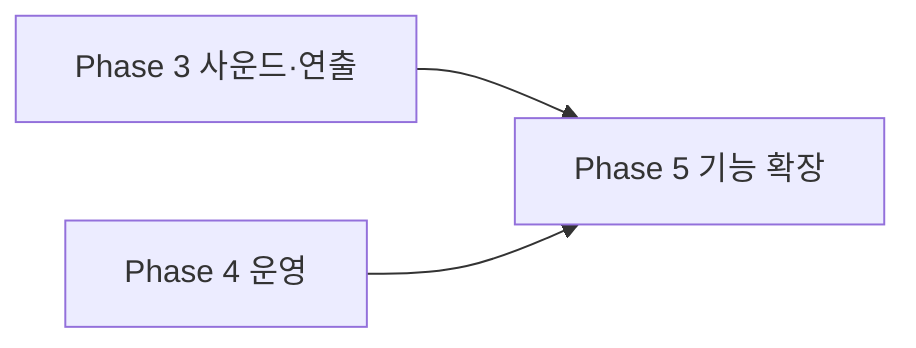

# ROADMAP — 개발 로드맵 (남은 작업)

2026-06-11 기준. 완료된 항목은 제거하고 남은 작업만 남겼습니다.

> **완료분(제거):** Phase 1 릴리스 차단 요소, Phase 2 번들·데이터 안정성, Phase 4 유지보수(세션·tier·worry 단일화, 타이머/피드백 정리), 코드 위험·정리 7건(타입·접근성 버튼화·CSS 스코프·Analytics 제거 등).

---

## 성능 잔여 항목

| #   | 작업                  | 위치/메모                                                                 |
| --- | --------------------- | ------------------------------------------------------------------------- |
| 1   | splash 자산 최적화    | `src/page/Splash.tsx` — splash.json(원본 약 372KB) Lottie 정적 import. 초기 경로(/)라 lazy 불가, WebP 시퀀스/경량화 검토 |
| 2   | Galmuri 폰트 self-host | `src/styles/index.css:1` — 현재 CDN(jsdelivr) `@2.40.3`로 버전 고정됨. 필요한 woff2 self-host 시 CDN 의존 제거 |

---

## Phase 3 — 사운드와 게임 연출 (1~2주)

**목표:** 타격감과 결과 연출 개선

### 사운드 MVP

| #   | 작업                                    | 문서            |
| --- | --------------------------------------- | --------------- |
| 1   | 오디오 에셋 라이선스 확정               | AUDIO §9        |
| 2   | audio provider/hook 및 사용자 mute 설정 | AUDIO §5        |
| 3   | hit, countdown, game BGM                | AUDIO Phase A~B |
| 4   | whoosh, stop, result sound              | AUDIO §4        |

### 게임플레이

> 완료: 카운트다운 progress ring·타이머 progress bar(마지막 5초 적색), 콤보 milestone 문구와 실시간 거리(m) 표시, blanket-fly ease-out easing과 stage 배경 crossfade, 타격 시 `navigator.vibrate` 햅틱, GameResult stage-height resize 대응.

| #   | 작업                              | 메모                     |
| --- | --------------------------------- | ------------------------ |
| 8   | 결과 연출 skip과 delay 조정       | blanket-stop 후 1초 delay 유지 중. "결과 보기" 스킵 버튼 미구현 |
| 9   | 실제 기기 멀티터치 검증           | 햅틱은 구현됨. iOS/Android 동시 pointer·제스처 동작은 실기기 확인 필요 |

### 접근성

> 완료: 전역 touch-action 해제·클릭 카드 버튼화, 모달 `role="dialog"`/`aria-modal`/ESC/focus trap(`useModal`), 게임 영역 키보드 입력(Space·Enter)과 `role`/`tabIndex`/`aria-label`, `prefers-reduced-motion` 대응(`animated.css`), 폼 label·글자 수 카운터.

남은 접근성 항목 없음(코드 적용 완료). 추가 검증은 실기기 스크린리더 테스트 정도.

---

## Phase 4 — 운영 (잔여, 1~2주)

| #   | 작업                             | 문서                  |
| --- | -------------------------------- | --------------------- |
| 1   | 신고/숨김 및 삭제 요청 절차      | firestore.rules (현재 클라이언트 delete 차단) |
| 2   | Firebase Anonymous Auth 검토     | firestore.rules (헤더 주석)                   |
| 3   | Analytics 재도입 시 목적·동의 결정 (현재 초기화 제거됨) | ARCHITECTURE §5.1            |
| 4   | 브라우저 E2E와 Rules test 확대   | DEVELOPMENT §8                                |

---

## Phase 5 — 기능 확장

### 사용자·소셜

| 기능             | 설명                  | 선행 조건                 |
| ---------------- | --------------------- | ------------------------- |
| 프로필/내 기록   | 플레이 기록과 통계    | 인증, 삭제 정책           |
| 결과 이미지 공유 | canvas 기반 SNS 카드  | 개인정보 노출 검토        |
| 친구 비교        | 초대 링크와 제한 랭킹 | abuse 방지                |
| 일일 챌린지      | 카테고리/배율 변화    | Analytics와 밸런스 데이터 |

### 운영

| 기능                 | 설명                                |
| -------------------- | ----------------------------------- |
| 관리자 도구          | 신고 검토, 숨김, 삭제               |
| 비정상 점수 대응     | 서버 검증 또는 Cloud Function 집계  |
| App Check/rate limit | 자동화 abuse 완화                   |
| PWA                  | 홈 화면 추가와 제한적 오프라인 지원 |
| 다국어               | 공개 정책과 에셋 문구 포함 번역     |

### 공유 메타데이터

기본 OG 태그는 이미 `index.html`에 있습니다. 남은 작업은 상대 경로인 `og:image`를 절대 URL로 검증하고, 결과별 동적 공유 카드가 필요하면 별도 렌더링 방식을 설계하는 것입니다.

### 연출·UX 폴리시 (미착수, 선택)

코드 적용이 끝난 항목 외 남은 아이디어:

| 아이디어              | 설명                                                       |
| --------------------- | ---------------------------------------------------------- |
| stage별 particle/Lottie | stage 2+ 별·구름, stage 4 UFO beam, 전환 시 짧은 Lottie    |
| 콤보 배율 게임플레이  | 일정 간격 내 연속 터치 시 점수 배율(난이도 추가)           |
| ModalCard 공통 컴포넌트 | `border-[3px] border-black bg-white` 반복 패턴 추출        |
| Splash 스킵           | Lottie 자동 이동 전 탭하여 스킵                            |
| ErrorBoundary 리포팅  | `ErrorFallBack`에 오류 ID·전송 추가                        |
| 결과 skip 버튼        | blanket 연출 중 "결과 보기"로 즉시 모달                    |

---

## 의존성 관계

---

## 문서 인덱스

| 영역          | 관련 문서                                    |
| ------------- | -------------------------------------------- |
| 제품 현황     | [PRD.md](./PRD.md)                           |
| 아키텍처      | [ARCHITECTURE.md](./ARCHITECTURE.md)         |
| 사운드        | [AUDIO.md](./AUDIO.md)                       |
| 개발 절차     | [DEVELOPMENT.md](./DEVELOPMENT.md)           |
