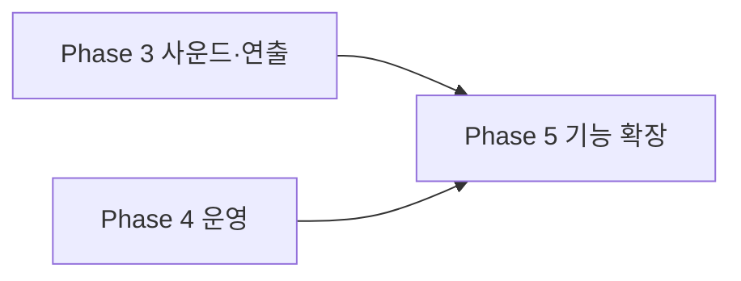

# ROADMAP — 개발 로드맵 (남은 작업)

**2026-09-16 대조 기준.** 완료된 항목은 제거하고 남은 작업만 남겼습니다.

> **2026-09-16 Rules production 배포 완료.** 그 전까지 배포본은 2025-04-15 테스트 모드(`allow read, create, update: if true`)였습니다.

> **2026-09-16 보안 조치 완료:** 의존성 패치(react-router-dom 6.30.6, vite 7.3.6), 배포 보안 헤더 + CSP Report-Only, Firestore 점수 상한·닉네임 형식 검증, CI 토큰 최소 권한 및 `pnpm audit --prod` 리포트, Dependabot 월간 패치 추적, `.env.example` 추가.

> **완료분(제거):** Phase 1 릴리스 차단 요소, Phase 2 번들·데이터 안정성, Phase 4 유지보수(세션·tier·worry 단일화, 타이머/피드백 정리), 코드 위험·정리 7건(타입·접근성 버튼화·CSS 스코프·Analytics 제거 등), 게임 연출·접근성 개선, 공감 트랜잭션 처리, GitHub Actions CI(lint·build·test·rules) 구축.

---

## 성능 잔여 항목

빌드 기준(2026-09-16): 메인 chunk **1,032KB**(gzip 481KB) — Vite 500KB 경고 지속.

| #   | 작업                     | 위치/메모                                                                                                          |
| --- | ------------------------ | ------------------------------------------------------------------------------------------------------------------ |
| 1   | splash 자산 최적화       | `src/page/Splash.tsx` — splash.json(372KB)을 정적 import. 초기 경로(`/`)라 lazy 불가. WebP 시퀀스/경량화/dotLottie 검토 |
| 2   | 메인 chunk 분할          | `vite.config.ts`에 `build.rollupOptions.output.manualChunks` 미설정. lottie-web·react 벤더 분리 검토                  |
| 3   | Galmuri 폰트 self-host   | `src/styles/index.css:1` — CDN(jsdelivr) `@2.40.3` 고정. `index.html`에 preconnect는 적용됨. 필요한 woff2만 self-host 시 CDN 의존 제거 |
| 4   | 미사용 Lottie 파일 정리  | `src/assets/lottie/loading.json`(819KB) — CSS 스피너로 교체 후 참조 없음. 저장소에서 제거 검토                         |
| 5   | 이미지 로딩 타이밍 정리  | `assetsInlineLimit`(기본 4096B) 인라인 이원화·이미지 크기 미지정·튜토리얼 사전 디코딩 누락 — 조치 순서는 [ISSUE-IMAGE-LOADING.md](./ISSUE-IMAGE-LOADING.md) §5 |
| 6   | 목록 이미지 lazy load    | `src/page/Content.tsx` 카드 이미지에 `loading="lazy"` 미적용                                                          |
| 7   | `og:image` 절대 URL      | `index.html` — 현재 `/og-main-image.webp` 상대 경로. 공유 미리보기 실제 동작 확인 필요                                 |

---

## Phase 3 — 사운드와 게임 연출

**목표:** 타격감과 결과 연출 개선

### 사운드 MVP (미착수)

| #   | 작업                                    | 문서            |
| --- | --------------------------------------- | --------------- |
| 1   | 오디오 에셋 라이선스 확정               | AUDIO §9        |
| 2   | audio provider/hook 및 사용자 mute 설정 | AUDIO §5        |
| 3   | hit, countdown, game BGM                | AUDIO Phase A~B |
| 4   | whoosh, stop, result sound              | AUDIO §4        |

### 게임플레이 (잔여)

> 완료: 카운트다운 progress ring·타이머 progress bar(마지막 5초 적색), 콤보 milestone 문구(20/30/50)와 실시간 거리(m) 표시, blanket-fly easing과 stage 배경 crossfade, 타격 시 `navigator.vibrate` 햅틱, GameResult stage-height resize 대응, 배경 이미지 디코딩 후 시작 버튼 활성화.

| #   | 작업                        | 메모                                                                     |
| --- | --------------------------- | ------------------------------------------------------------------------ |
| 1   | 결과 연출 skip과 delay 조정 | blanket-stop 후 1초 delay 유지 중. "결과 보기" 스킵 버튼 미구현          |
| 2   | 실제 기기 멀티터치 검증     | 햅틱은 구현됨. iOS/Android 동시 pointer·제스처 동작은 실기기 확인 필요   |

### 접근성 (잔여)

> 완료: 전역 touch-action 해제·클릭 카드 버튼화, 모달 `role="dialog"`/`aria-modal`/ESC/focus trap·포커스 복원(`useModal`), 게임 영역 키보드 입력(Space·Enter)과 `role`/`tabIndex`/`aria-label`, `prefers-reduced-motion` 대응(`animated.css`), 폼 label·글자 수 카운터.

남은 항목은 실기기 스크린리더(VoiceOver/TalkBack) 검증입니다. 코드 레벨 대응은 완료 상태입니다.

---

## Phase 4 — 운영 (잔여)

| #   | 작업                                                    | 문서/메모                                        |
| --- | ------------------------------------------------------- | ------------------------------------------------ |
| 1   | 앱 재배포 (보안 헤더·react-router 패치 반영)            | `vercel.json`·의존성 변경은 Vercel 재배포 전까지 적용되지 않음. Rules는 2026-09-16 배포 완료 |
| 2   | CSP를 Report-Only → enforce 전환                        | 재배포 후 위반 보고 확인 필요 — DEVELOPMENT §7.5   |
| 3   | Firebase 예산 알림 설정 (콘솔, 코드 변경 없음)          | 쓰기 스팸 시 요금 누적을 메일로 감지 — DEVELOPMENT §7.4 |
| 4   | 신고/숨김 및 삭제 요청 절차                             | `firestore.rules` — 클라이언트 delete 차단 상태  |
| 5   | Anonymous Auth 도입                                     | 소유권 검증 부재로 사칭·자작 기록 차단 불가. **4번(삭제·신고) 착수 시 선행 필수**. App Check(reCAPTCHA)는 개인 프로젝트 규모에 과해 제외 — DEVELOPMENT §7.4 |
| 6   | react-router v7 업그레이드 검토                          | 잔여 권고문 2건은 7.18.0 이상에서만 해소. SSR 미사용·경로 하드코딩이라 실질 위험 낮음 |
| 7   | Analytics 재도입 시 목적·동의 결정 (현재 초기화 제거됨) | ARCHITECTURE §5.1                                |
| 8   | 브라우저 E2E 도입                                       | DEVELOPMENT §9 — Rules 테스트는 CI 연결 완료      |
| 9   | `engines` 명시                                          | DEVELOPMENT §3 (`.env.example`은 추가 완료)        |

---

## Phase 5 — 기능 확장

### 사용자·소셜

| 기능             | 설명                  | 선행 조건                 |
| ---------------- | --------------------- | ------------------------- |
| 프로필/내 기록   | 플레이 기록과 통계    | Anonymous Auth, 삭제 정책 |
| 결과 이미지 공유 | canvas 기반 SNS 카드  | 개인정보 노출 검토        |
| 친구 비교        | 초대 링크와 제한 랭킹 | abuse 방지                |
| 일일 챌린지      | 카테고리/배율 변화    | Analytics와 밸런스 데이터 |

### 운영

| 기능                 | 설명                                |
| -------------------- | ----------------------------------- |
| 관리자 도구          | 신고 검토, 숨김, 삭제               |
| 비정상 점수 대응     | 서버 검증 또는 Cloud Function 집계  |
| App Check/rate limit | 자동화 abuse 완화                   |
| PWA                  | 홈 화면 추가와 제한적 오프라인 지원 |
| 다국어               | 공개 정책과 에셋 문구 포함 번역     |

### 공유 메타데이터

기본 OG 태그는 이미 `index.html`에 있습니다. 남은 작업은 상대 경로인 `og:image`를 절대 URL로 검증하고, 결과별 동적 공유 카드가 필요하면 별도 렌더링 방식을 설계하는 것입니다.

### 연출·UX 폴리시 (미착수, 선택)

| 아이디어                | 설명                                                    |
| ----------------------- | ------------------------------------------------------- |
| stage별 particle/Lottie | stage 2+ 별·구름, stage 4 UFO beam, 전환 시 짧은 Lottie |
| 콤보 배율 게임플레이    | 일정 간격 내 연속 터치 시 점수 배율(난이도 추가)        |
| ModalCard 공통 컴포넌트 | `border-[3px] border-black bg-white` 반복 패턴 추출      |
| Splash 스킵             | Lottie 자동 이동 전 탭하여 스킵                          |
| ErrorBoundary 리포팅    | `ErrorFallBack`에 오류 ID·전송 추가                      |
| 결과 skip 버튼          | blanket 연출 중 "결과 보기"로 즉시 모달                  |

### 코드 정리 후보

| 위치                                     | 내용                                                                                |
| ---------------------------------------- | ----------------------------------------------------------------------------------- |
| `src/components/game/GameResult.tsx`     | 배경/이불 ``가 같은 부모에서 동일한 `key={stage}`를 사용 — React key 중복 경고 대상 (ISSUE-IMAGE-LOADING §3.6) |
| `src/components/Loading.tsx`             | 내부는 CSS 스피너인데 export 이름이 `LottieLoading`으로 남아 있음                     |
| `src/firebase/firebaseClient.ts`         | 사용하지 않는 `measurementId`가 config에 남아 있음                                    |

---

## 의존성 관계

---

## 문서 인덱스

| 영역      | 관련 문서                            |
| --------- | ------------------------------------ |
| 제품 현황 | [PRD.md](./PRD.md)                   |
| 이미지 로딩 이슈 | [ISSUE-IMAGE-LOADING.md](./ISSUE-IMAGE-LOADING.md) |
| 아키텍처  | [ARCHITECTURE.md](./ARCHITECTURE.md) |
| 사운드    | [AUDIO.md](./AUDIO.md)               |
| 개발 절차 | [DEVELOPMENT.md](./DEVELOPMENT.md)   |
