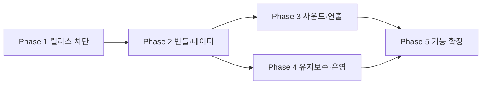

# ROADMAP — 개발 로드맵

2026-06-10 코드·문서 감사 결과를 반영한 우선순위입니다. 기간은 담당 인원과 디자인/에셋 준비 상태에 따라 다시 산정합니다.

---

## Phase 1 — 릴리스 차단 요소 (1~3일)

**목표:** 코드 검증 통과, 점수/데이터 오류 수정, 배포 권한 확인

| #   | 작업                                       | 우선순위 | 문서                |
| --- | ------------------------------------------ | -------- | ------------------- |
| 1   | Game.tsx 조건부 Hook 수정, lint error 제거 | P0       | REFACTORING §1      |
| 2   | 0점 저장·표시 조건 수정                    | P0       | REFACTORING §2      |
| 3   | WorryContentModal id 보존                  | P0       | REFACTORING §3      |
| 4   | 실제 Firestore Rules 감사 및 저장소 반영   | P0       | SECURITY-PRIVACY §2 |
| 5   | 공개 UGC/개인정보 입력 금지 안내           | P0       | SECURITY-PRIVACY §3 |
| 6   | QueryClient 단일 생성                      | P1       | REFACTORING §5      |
| 7   | Rank/Content 오류·빈 상태 UI               | P1       | UI-UX §2, §7        |
| 8   | RoomNameModal maxLength 5 통일             | P2       | UI-UX §3            |
| 9   | `npm ci`로 lockfile과 설치 상태 동기화     | P0       | DEVELOPMENT §2      |

**완료 기준:**

- `npm run lint`와 `npm run build` 성공
- 0점과 고민 수정 흐름 수동 검증
- Rules 테스트 또는 배포 Rules 리뷰 기록 존재
- 공개 저장 안내가 고민 제출 전에 노출

---

## Phase 2 — 번들·데이터 안정성 (3~5일)

**목표:** 초기 로딩 비용 감소, Firestore write 원자성 확보

### 성능

| #   | 작업                                            | 문서               |
| --- | ----------------------------------------------- | ------------------ |
| 1   | 미사용 Remix Icon import 제거                   | PERFORMANCE §3.1   |
| 2   | LottieLoading 경량화, splash 자산 최적화        | PERFORMANCE §3.2   |
| 3   | `npm ci` 기준 bundle baseline과 visualizer 기록 | PERFORMANCE §1, §5 |
| 4   | 게임 배경 load/decode gate                      | PERFORMANCE §3.3   |
| 5   | GameResult stage preload/decode                 | PERFORMANCE §3.4   |
| 6   | 타격 effect profile 후 timer/DOM 최적화         | PERFORMANCE §3.5   |

### API 및 품질

| #   | 작업                                   | 문서           |
| --- | -------------------------------------- | -------------- |
| 7   | reaction `runTransaction` + Rules 보강 | REFACTORING §7 |
| 8   | 점수 저장 후 query invalidation        | REFACTORING §8 |
| 9   | Firestore converter/schema validation  | REFACTORING §9 |
| 10  | 핵심 점수·tier·schema 단위 테스트      | DEVELOPMENT §8 |
| 11  | PR lint/build CI                       | DEVELOPMENT §8 |

**완료 기준:**

- 초기 메인 JS와 asset 총량 전후 수치 기록
- 느린 네트워크에서도 배경 준비 전 게임 시작 불가
- 공감 count와 user reaction이 원자적으로 저장
- PR에서 lint/build 자동 검증

---

## Phase 3 — 사운드와 게임 연출 (1~2주)

**목표:** 타격감과 결과 연출 개선

### 사운드 MVP

| #   | 작업                                    | 문서            |
| --- | --------------------------------------- | --------------- |
| 1   | 오디오 에셋 라이선스 확정               | AUDIO §9        |
| 2   | audio provider/hook 및 사용자 mute 설정 | AUDIO §5        |
| 3   | hit, countdown, game BGM                | AUDIO Phase A~B |
| 4   | whoosh, stop, result sound              | AUDIO §4        |

### 게임플레이

| #   | 작업                              | 문서                     |
| --- | --------------------------------- | ------------------------ |
| 5   | 카운트다운/타이머 progress UI     | GAME-EXPERIENCE §1.5     |
| 6   | 콤보 milestone과 실시간 거리 표시 | GAME-EXPERIENCE §1.3, §3 |
| 7   | blanket easing과 stage crossfade  | GAME-EXPERIENCE §2.3~2.4 |
| 8   | 결과 연출 skip과 delay 조정       | GAME-EXPERIENCE §2.8     |
| 9   | 실제 기기 멀티터치·햅틱 검증      | GAME-EXPERIENCE §1.4~1.6 |

### 접근성

| #   | 작업                                   | 문서     |
| --- | -------------------------------------- | -------- |
| 10  | 모달 focus trap, ESC, dialog semantics | UI-UX §4 |
| 11  | 키보드 게임 입력과 클릭 카드 버튼화    | UI-UX §4 |
| 12  | `prefers-reduced-motion` 대응          | UI-UX §4 |
| 13  | 전역 touch-action 제한 해제            | UI-UX §4 |

---

## Phase 4 — 유지보수와 운영 (1~2주)

| #   | 작업                             | 문서                  |
| --- | -------------------------------- | --------------------- |
| 1   | localStorage session helper      | REFACTORING §14       |
| 2   | score tier와 worry 데이터 단일화 | REFACTORING §15~16    |
| 3   | timer cleanup과 dead code 정리   | REFACTORING §13, §19  |
| 4   | alert/clipboard 피드백 통합      | REFACTORING §22       |
| 5   | 신고/숨김 및 삭제 요청 절차      | SECURITY-PRIVACY §2.3 |
| 6   | Firebase Anonymous Auth 검토     | SECURITY-PRIVACY §2.1 |
| 7   | Analytics 목적·동의 결정         | SECURITY-PRIVACY §2.4 |
| 8   | 브라우저 E2E와 Rules test 확대   | DEVELOPMENT §8        |

---

## 잔여 코드 품질 항목

Phase 1·2·4 진행 후 코드에 아직 반영되지 않은 항목입니다. (구 PERFORMANCE·REFACTORING 문서에서 통합)

### 성능

| #   | 작업                                       | 위치/메모                                                                 |
| --- | ------------------------------------------ | ------------------------------------------------------------------------- |
| 1   | splash 자산 최적화                         | `src/page/Splash.tsx` — splash.json(원본 약 372KB) Lottie 정적 import. 초기 경로(/)라 lazy 불가, WebP 시퀀스/경량화 검토 |
| 2   | Galmuri 폰트 self-host                      | `src/styles/index.css:1` — 현재 CDN(jsdelivr) `@2.40.3`로 버전은 고정됨. 필요한 woff2 self-host 시 CDN 의존 제거 |

### 코드 위험·정리

| #   | 작업                                            | 위치/메모                                                                 |
| --- | ----------------------------------------------- | ------------------------------------------------------------------------- |
| 1   | 전역 `touch-action`/`user-select`를 게임 영역으로 제한 | `src/styles/index.css:12-19` — body 전역 적용이 Content/Rank 스크롤·텍스트 선택을 해침. 연타 영역에만 적용 |
| 2   | `createdAt` 타입 일치                            | `src/types/game.ts:39` — `string`이지만 저장값은 `serverTimestamp()`. `Timestamp \| null` 등 실제 읽기 상태와 일치 |
| 3   | Analytics 목적·동의 정의 또는 초기화 제거        | `src/firebase/firebaseClient.ts:23` — `getAnalytics` 초기화만 있고 이벤트/동의 안내 없음 |
| 4   | `RankTab.tsx` 파일명 ↔ 컴포넌트명 일치           | 실제 컴포넌트명은 `TabNavigation`. 검색성·stack trace 가독성 |
| 5   | 클릭 가능 비버튼 요소 button화                   | `Content.tsx` 카드, `Bed.tsx` 대화창, `SpecialThanks.tsx` span — 키보드 접근 불가 (UI-UX §4 연계) |
| 6   | `Rank.tsx` 불필요한 `useMemo` 정리               | `ranks.slice(3)` 메모이제이션 불필요                                       |
| 7   | 오래된 TODO/주석 정리                            | `src/firebase/firebaseClient.ts:5` 보일러플레이트 TODO 등                  |

---

## Phase 5 — 기능 확장

### 사용자·소셜

| 기능             | 설명                  | 선행 조건                 |
| ---------------- | --------------------- | ------------------------- |
| 프로필/내 기록   | 플레이 기록과 통계    | 인증, 삭제 정책           |
| 결과 이미지 공유 | canvas 기반 SNS 카드  | 개인정보 노출 검토        |
| 친구 비교        | 초대 링크와 제한 랭킹 | abuse 방지                |
| 일일 챌린지      | 카테고리/배율 변화    | Analytics와 밸런스 데이터 |

### 운영

| 기능                 | 설명                                |
| -------------------- | ----------------------------------- |
| 관리자 도구          | 신고 검토, 숨김, 삭제               |
| 비정상 점수 대응     | 서버 검증 또는 Cloud Function 집계  |
| App Check/rate limit | 자동화 abuse 완화                   |
| PWA                  | 홈 화면 추가와 제한적 오프라인 지원 |
| 다국어               | 공개 정책과 에셋 문구 포함 번역     |

### 공유 메타데이터

기본 OG 태그는 이미 `index.html`에 있습니다. 남은 작업은 상대 경로인 `og:image`를 절대 URL로 검증하고, 결과별 동적 공유 카드가 필요하면 별도 렌더링 방식을 설계하는 것입니다.

---

## 의존성 관계

---

## 문서 인덱스

| 영역          | 관련 문서                                    |
| ------------- | -------------------------------------------- |
| 제품 현황     | [PRD.md](./PRD.md)                           |
| 아키텍처      | [ARCHITECTURE.md](./ARCHITECTURE.md)         |
| 코드 위험·성능 | 본 문서 「잔여 코드 품질 항목」               |
| UI/UX         | [UI-UX.md](./UI-UX.md)                       |
| 게임 연출     | [GAME-EXPERIENCE.md](./GAME-EXPERIENCE.md)   |
| 사운드        | [AUDIO.md](./AUDIO.md)                       |
| 개발 절차     | [DEVELOPMENT.md](./DEVELOPMENT.md)           |
| 보안/개인정보 | [SECURITY-PRIVACY.md](./SECURITY-PRIVACY.md) |
